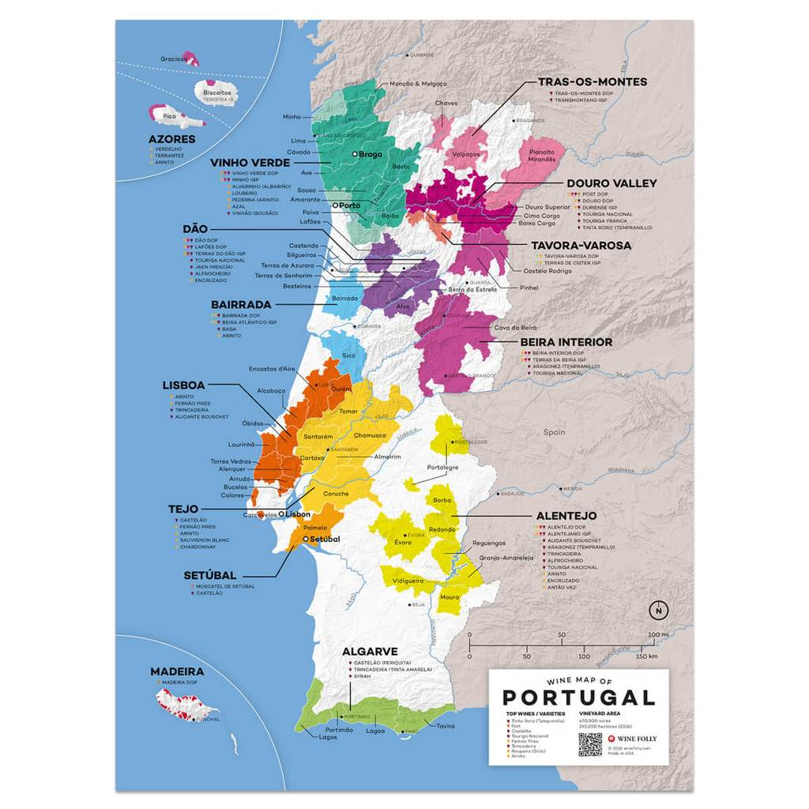
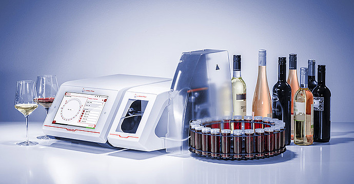
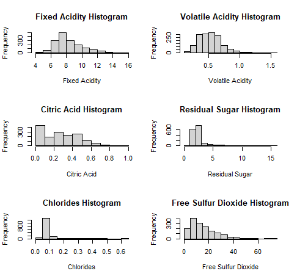
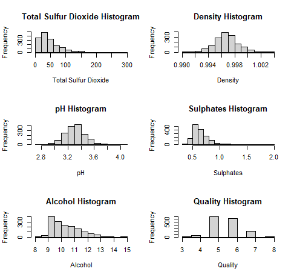
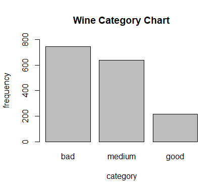
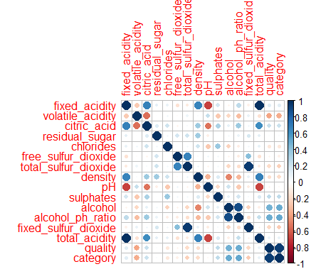
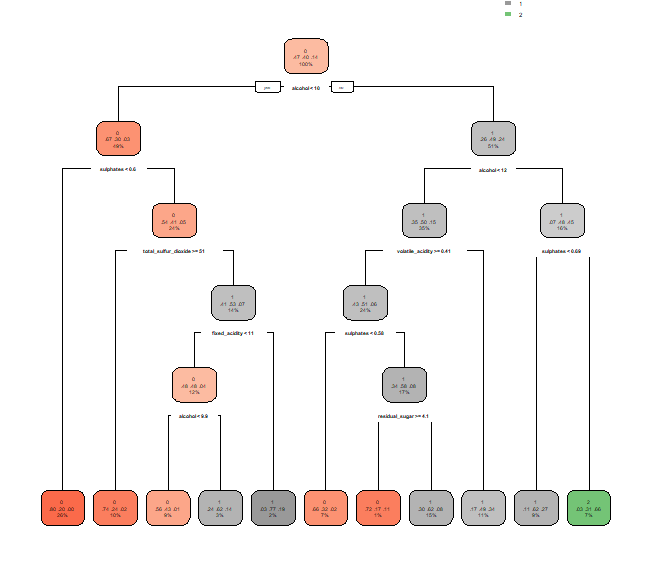

```{r setup, include=FALSE, message=FALSE, warning=FALSE}
library(tidyverse)
library(lme4)
knitr::opts_chunk$set(echo = FALSE, cache=FALSE)
knitr::knit_hooks$set(plot = function(x, options)  {
  paste0(knitr::hook_plot_tex(x, options), "\n\\FloatBarrier\n")
})
```

# 1. Introduction

The goal is to predict quality of wine based on chemical measurements. 

In this project we will be working with a dataset of 1,599 observations for Portuguese red wines of “Vinho Verde” type, where Vinho Verde refers to the young age of the wine, produced 3 to 6 months after the grapes are harvested in the Minho province of Northern Portugal. 

```{r, echo=FALSE, fig.cap="Map of Portugal that shows Vinho Verde Province", out.width = "50%"}
setwd("C:\\data\\capstone\\cyo")

```

The dataset contains twelve variables - eleven for different chemical characteristics, such as pH level and alcohol percentage and the last twelfth variable is the quality of the wine. It will be the outcome variable which we are going to predict based on the chemical characteristics. This dataset is available at the UCI machine learning repository of https://archive.ics.uci.edu/ml/datasets/wine+quality and at the kaggle website: https://www.kaggle.com/uciml/red-wine-quality-cortez-et-al-2009/tasks?taskId=1738.

The eleven variables measuring chemical properties of the wine are the following:

  1. Fixed Acidity: measure of non-volatile acids that do not evaporate readily
  
  2. Volatile Acidity: measure of high acetic acid in wine which leads to an unpleasant vinegar taste
      
  3. Citric Acid: amount of citric acid which acts as a preservative to increase acidity. 
  
  4. Residual Sugar: amount of sugar remaining after fermentation 
      
  5. Chlorides: the amount of salt in the wine
  
  6. Free Sulfur Dioxide SO2: measure of substance which prevents microbial growth and the oxidation of        wine
  
  7. Total Sulfur Dioxide: amount of free SO2 + bound forms of SO2
  
  8. Density: wine density (sweeter wines have a higher density)
  
  9. pH: level of acidity on a scale of 0–14
  
  10. Alcohol
         
  11. Sulphates: wine additives which act as anti-microbials and antioxidants

The standard red wine composition is shown on this pie chart:

```{r, echo=FALSE, fig.cap="Composition of Red Wine", out.width = '100%', out.width = "50%"}
setwd("C:\\data\\capstone\\cyo")
knitr::include_graphics("red_wine_composition.png")
```

The twelfth variable in the dataset is the quality of the wine. It is rated on a 0-10 scale. To assign the scale value each wine sample is evaluated by a minimum of three tasters using blind tasting, and then the wine is graded on the 0-10 scale using the median of the scores of the tasters.

The components of wine are measured by a wine analyzer. A wine analyzer is a standalone device that measures characteristics of fifteen or so variables.

```{r, echo=FALSE, fig.cap="Wine Analyzer", out.width = "50%"}
setwd("C:\\data\\capstone\\cyo")

```

The units of measurements are the following: fixed acidity, volatile acidity, citric acid, residual sugar, chlorides, sulphates and density are measured in $g/dm^3$,  free sulfur dioxide and  total sulfur dioxide are measured in $mg/dm^3$, alcohol in percent by volume, pH  is the measurement of the hydrogen ion concentration  pH=log(aH+)  and has no units.

The goal of the project is to train some models for predicting how good different wines are and see how they perform. Multiples models will be compared to see how well they do in terms of accuracy and root mean squared error (RMSE).

# Section 1: Data Overview

The following histograms show the distribution of all the variables we are initially given:

```{r, echo=FALSE, fig.cap="Histograms of the first six variables", out.width = '100%'}
setwd("C:\\data\\capstone\\cyo")

```

Fixed Acidity and Free Sulfur Dioxide have a fairly typical right-skew. Volatile acidity is centered around 0.5 with very few values of <0.3 or >0.7. In the citric acid histogram we can see that the category of 0-0.1 is the most populous and then the overall trend is that the amount of wines decreases as the level of citric acid increases. The overwhelming majority of wines have residual sugar levels between 1 and 3 $g/dm^3$. The overwhelming majority of wines have chlorides levels between 0.05 and 0.1. 

&nbsp;

```{r, echo=FALSE, fig.cap="Histograms of the last six variables", out.width = '100%'}
setwd("C:\\data\\capstone\\cyo")

```

Total Sulfur Dioxide, Sulphates and Alcohol are right-skewed in this set. Density, pH and quality are normally distributed. Between 9% and 10% alcohol is the most popular category with the amount of wines steadily declining as the amount of alcohol increases, after the 9% - 10% interval. For quality the overwhelming majority if wines fall into the middle categories with very few in the lower third and very few in the upper third. Most wines have a density of about 0.996.  

The below table shows the means and other basic measures about the spread of each of the variables:

```{r, echo=FALSE, fig.cap="Summary of all variables", out.width = '100%'}
setwd("C:\\data\\capstone\\cyo")
knitr::include_graphics("var16_summary.png")
```


&nbsp;

We modify this initial dataset by adding four variables derived from the initial variables:

alcohol_ph_ratio = alcohol/pH

fixed_sulfur_dioxide = total sulfur dioxide - free sulfur dioxide

total_acidity = fixed acidity + volatile acidity

The former three are recommended to use by some wine experts.

We also modify the outcome variable into a categorical variable "category", having values of "bad", "medium" and "good" in regards to the quality of wine.

The variable "category" groups the wine qualities into categories with the high quality category consisting of ratings 7 and 8 (no wines in this dataset have ratings 9 or 10), the "bad" category consists of qualities 5, 4 and 3 (no wines in this dataset have a rating of 2 or less) and the medium category consists of rating 6. The numeric values corresponding to these categories are 0 for bad, 1 for medium and 2 for good. This categorization is natural as the scale has very few really bad wines with the rating under 5, and very few excellent wines with the rating 8, as will be seen later. There are only 10 wines of quality 3 and 53 wines of quality 4. In the meanwhile here is the distribution of the three newly created categories:

```{r, echo=FALSE, fig.cap="Wine Category Bar Chart", out.width = '100%'}
setwd("C:\\data\\capstone\\cyo")

```

By the above-mentioned categorization good wines constitute a small percentage of all of them, 13.6%. The bad category is the most populous containing 46.5% with the medium category having 39.9%. 

Figure 8 graphically displays a correlation matrix where blue color is used for positive correlations and red color for negative correlations. Circle size and color intensity are proportional to the size of the correlation coefficients.

```{r, echo=FALSE, fig.cap="Correloplot", out.width = '100%'}
setwd("C:\\data\\capstone\\cyo")

```

We see that the level of alcohol correlates with quality more than any of the originally provided variables. Free sulfur dioxide and total sulfur dioxides are highly correlated with each other, and fixed acidity and volatile acidity have a very strong correlation with one another. Strong negative correlation exists between pH and many of the acidities, not surprisingly.

Below are the boxplots that show how the predictor variables depend on the wine quality category. 
I will be sometimes using boxplots with outliers and sometimes without outliers, depending on which one
is more informative for the predictor. Outliers on the boxplots will be displayed as points. Anything falling outside of the first quartile minus 1.5\*IQR and third quartile plus 1.5\*IQR is classified as an outlier.

```{r, echo = FALSE, message = FALSE}
# 1. loading the required libraries

library(readxl)
library(caret)
library(class)
library(tidyverse)
library(rpart.plot)
library(randomForest)
library(rpart)
library(corrplot)

# 2. setting output format and reading in the dataset

options(dplyr.width = Inf)

setwd("C:\\data\\capstone\\cyo")

wine_data = read_csv("winequality-red.csv")

wine_data = wine_data %>% mutate(alcohol_ph_ratio = alcohol/pH)
wine_data = wine_data %>% mutate(fixed_sulfur_dioxide = `total sulfur dioxide` - `free sulfur dioxide`)
wine_data = wine_data %>% mutate(total_acidity = `fixed acidity` + `volatile acidity`)
wine_data = wine_data %>% mutate(quality1 = quality)
wine_data = subset(wine_data, select = -c(quality))
wine_data = wine_data %>% rename(quality = quality1)

wine_data = wine_data %>% mutate(category = if_else(quality < 6, 0, ifelse(quality > 6, 2, 1)))

wine_data = wine_data %>% rename(fixed_acidity = `fixed acidity`, volatile_acidity = `volatile acidity`, citric_acid = `citric acid`, residual_sugar = `residual sugar`, free_sulfur_dioxide = `free sulfur dioxide`, total_sulfur_dioxide = `total sulfur dioxide`)

par(mfrow = c(3,2))

boxplot(fixed_acidity ~ category, data = wine_data, outline = FALSE, ylab = "Category", xlab = "Fixed Acidity", horizontal = TRUE, col = c("green", "yellow", "red"))
boxplot(volatile_acidity ~ category, data = wine_data, ylab = "Category", xlab = "Volatile Acidity", horizontal = TRUE, col = c("green", "yellow", "red"))
boxplot(citric_acid ~ category, data = wine_data, ylab = "Category", xlab = "Citric Acid", horizontal = TRUE, col = c("green", "yellow", "red"))
boxplot(residual_sugar ~ category, data = wine_data, ylab = "Category", xlab = "Residual Sugar", horizontal = TRUE, col = c("green", "yellow", "red"))
boxplot(chlorides ~ category, data = wine_data, ylab = "Category", xlab = "Chlorides", horizontal = TRUE, col = c("green", "yellow", "red"))
boxplot(free_sulfur_dioxide ~ category, data = wine_data, outline = FALSE, ylab = "Category", xlab = "Free Sulfur Dioxide", horizontal = TRUE, col = c("green", "yellow", "red"))
```

As the quality of wine increases fixed acidity also increases a little bit with a more pronounced leap from the medium category to the good category than from the bad category to the medium category. The spread in fixed acidity is also larger in medium and good categories.

Here we see an inverse correlation between category and volatile acidity. The median level of volatile acidity steadily decreases as the category betters. We can also see that the bad wine category has a bunch of outliers with unusually high levels of volatile acidity.

As the wine quality betters the amount of citric acid slightly increases generally speaking. the IQR for the good category is notably smaller than for the other categories.

With residual sugar there does not seem to be much of a relation between its median and category. The thing that stands out here is the huge amount of outliers that are way higher than the median. This applies for each of the categories.

With chlorides the median slightly decreases with higher categories and the IQR remains roughly the same. We can see that the size of outliers decreases as the category value increases.

The free sulfur dioxide median as well as the variance is slightly smaller for good wines than for the two other categories.


```{r, echo = FALSE, message = FALSE}
par(mfrow = c(3,2))
boxplot(total_sulfur_dioxide ~ category, data = wine_data, ylab = "Category", xlab = "Total Sulfur Dioxide", horizontal = TRUE, col = c("green", "yellow", "red"))
boxplot(density ~ category, data = wine_data, outline = FALSE, ylab = "Category", xlab = "Density", horizontal = TRUE, col = c("green", "yellow", "red"))
boxplot(pH ~ category, data = wine_data, outline = FALSE, ylab = "Category", horizontal = TRUE, col = c("green", "yellow", "red"))
boxplot(sulphates ~ category, data = wine_data, ylab = "Category", xlab = "Sulphates", horizontal = TRUE, col = c("green", "yellow", "red"))
boxplot(alcohol ~ category, data = wine_data, ylab = "Category", xlab = "Alcohol", horizontal = TRUE, col = c("green", "yellow", "red"))
```

Total sulfur dioxide slightly decreases as the category goes up, and so does the variance. The variance for the bad wines is much bigger than for the other categories.

Density slightly decreases as the category value increases and the variance in density for bad wines is smaller than for the rest.

There is very little change in ph from category to category. The variance of it for the good category is slightly smaller.

The higher the category the more sulphates typically. With that being said the wines with the greatest amount of sulphates are also not good. The bad and medium categories have more outliers when it comes to high levels of sulphates.

Alcohol on average increases notably as the quality increases. The graph shows a clear relationship. The bad category has the greatest amount of outliers and among those outliers lies a wine with the highest amount of alcohol out of all wines in the dataset.

# Section 2:  Methods/Analysis

After performing exploratory analysis I split the modified dataset of 1,599 rows with an 80%/20% split to divide it into a training and testing part, and applied four different algorithms to select the best model for predicting wine quality category. The final selection was done after running the models on the testing set. The idea is to compare the results and see which does the best job in terms of confusion matrix accuracy and RMSE.

The four methods are K-Nearest Neighbors (KNN), Classification And Regression Trees (CART) method, Random Forest (RF) and an ensemble using KNN, CART and RF.

## 2.1. KNN method
 
The KNN algorithm is used for classification and regression. In KNN classification the output is a categorical variable which defines a class. Each observation is assigned to a class by a plurality vote of its k nearest neighbors, where k is usually small. It can be equal to 1, in which case the observation is assigned to the same class as the nearest neighbor. This algorithm uses distance between the observations for classification. If the variables are measured on different scales then normalizing the data greatly improves the algorithm accuracy. The distance between two observations is calculated as euclidean distance between two points where the  formula is the square root of the sum of squared differences of the observation measurements. To apply the KNN method I normalized all of the predictors.

I ran the KNN algorithm for each observation in the test set by finding the closest observation(s
) to it from the training set. I tested the accuracy for k values 1 through 20 to determine which k value gives the most accurate result. Looking at the table of ks matched with their corresponding accuracies as well as looking at the graph of k vs accuracy the clear winner is k = 1, so this is the k value we will stick with. The graph displays a fairly straight forward decrease in accuracy as the number of neighbors increases. The obtained accuracy is 0.972 for k = 1. Below is the table and graph of the accuracy results for each of the ks:
 
```{r, echo=FALSE, fig.cap="Accuracy by k Table", out.width = '100%'}
setwd("C:\\data\\capstone\\cyo")
knitr::include_graphics("k_accuracy_table.png")
```

```{r, echo=FALSE, fig.cap="k vs Accuracy Graph", out.width = '100%'}
setwd("C:\\data\\capstone\\cyo")
knitr::include_graphics("k_rmse_graph.png")
```

Here are the results of the confusion matrix:

```{r, echo=FALSE, fig.cap="Confusion Matrix for KNN with k = 1", out.width = '100%'}
setwd("C:\\data\\capstone\\cyo")
knitr::include_graphics("knn_results.png")
```

## 2.2. CART method
A decision tree is another classification algorithm. A decision tree or a classification tree is built by splitting the source set. The algorithm starts from the root node of the tree, it  compares the values of the selected for the root variable with the pre-selcted cutoff, and based on this comparison branches  the corresponding to the next level node. The process continues until the node has all the same values of the classified variable, or when splitting no longer improves the GINI index or entropy which are measuring the impurity of the node (a node with multiple classes is impure, and a node with only one class is pure).

This method faired a little worse than KNN, resulting in the lowest accuracy and highest RMSE.

```{r, echo=FALSE, fig.cap="Decision Tree Diagram", out.width = '100%'}
setwd("C:\\data\\capstone\\cyo")

```

```{r, echo=FALSE, fig.cap="Confusion Matrix for Decision Tree Algorithm", out.width = '100%'}
setwd("C:\\data\\capstone\\cyo")
knitr::include_graphics("rpart_results.png")
```

## 2.3. Random Forest method
Random forest is a version of a decision tree ensemble method. It creates multiple
decision trees using multiple samples with replacement from the training dataset,
and then uses a plurality vote of all built trees. This works well as a single decision tree often
is prone to overfitting the data. The accuracy of random forest is generally better than the accuracy of one decision tree. The disadvantage of random forest is that
comparing to decision tree is not easily interpretable, and more similar to a
"blackbox" model.

```{r, echo=FALSE, fig.cap="Random Forest", out.width = '100%'}
setwd("C:\\data\\capstone\\cyo")
knitr::include_graphics("rf_results.png")
```

Random Forest produced an accuracy and an RMSE that is between those of KNN and decision tree.

## 2.4. Ensemble method

The final method that I used was an ensemble method of KNN, decision tree and random forest. 
This gave the second best result after KNN. I thought it was worth a try since some of the methods may work well for some wines and other methods for other wines.

```{r, echo=FALSE, fig.cap="Ensemble Results", out.width = '100%'}
setwd("C:\\data\\capstone\\cyo")
knitr::include_graphics("ensemble_results.png")
```

# Section 3: Results

The following table shows the performance of all methods used.

```{r, echo=FALSE, fig.cap="Results Table", out.width = '100%'}
setwd("C:\\data\\capstone\\cyo")
knitr::include_graphics("results_table.png")
```

The next table shows the accuracy, kappa and McNemar's test results. 

```{r, echo=FALSE, fig.cap="Overall Statistics", out.width = '100%'}
setwd("C:\\data\\capstone\\cyo")
knitr::include_graphics("results_expanded.png")
```

Using the criteria of Cohen's Kappa the results of KNN are almost perfect (0.81 - 1), the results of the decision tree method are fair (0.21 - 0.4), the results of random forest are moderate (0.41 - 0.6) and the results of the ensemble method are substantial (0.61 - 0.8). Kappa = (observed accuracy - expected accuracy)/(1 - expected accuracy). Is is a measure of how much the observed accuracy differs from the expected accuracy.

McNemar's test compares the rates of false positives and false negatives where small values for the test result show that the values occur at statistically different rates. For KNN the test is inapplicable and for all the other methods the result is statistically significant at the 5% level.

The following table summarizes the results for specificity and sensitivity.

```{r, echo=FALSE, fig.cap="Sensitivity and Specificity by Class", out.width = '100%'}
setwd("C:\\data\\capstone\\cyo")
knitr::include_graphics("results_spec_sens.png")
```

Sensitivity is the true positive rate, (true positives) / (true positives + false positives). It is the best for KNN and the lowest for the decision tree method.

Specificity is the true negative rate, (true negatives) / (true negatives + false negatives). Overall KNN fairs the best for specificity with some noticeable variation in specificity for the decision tree method. 
The following table shows the positive predictive values and negative predicted values. 

```{r, echo=FALSE, fig.cap="Predictive Values by Class", out.width = '100%'}
setwd("C:\\data\\capstone\\cyo")
knitr::include_graphics("results_predval.png")
```

The positive predicted value is defined as (sensitivity x prevalence) / ((sensitivity x prevalence) + ((1 – specificity) x (1 – prevalence)))

The positive predicted value fairs best for KNN and ensemble with KNN having less variance among categories.

Negative predicted value is defined as (specificity x (1 – prevalence)) / ((specificity x (1 – prevalence)) + ((1 – sensitivity) x prevalence))

The same can be said about the negative predicted value as was said about positive predicted value.

The last table shows the prevalence rates.

```{r, echo=FALSE, fig.cap="Prevalence Rates by Class", out.width = '100%'}
setwd("C:\\data\\capstone\\cyo")
knitr::include_graphics("results_prev_rates.png")
```

Detection rate is (true positives) / (total number of cases). It is generally rather uneven by category but on average again fairs best among KNN and then ensemble.

Detection prevalence is the number of cases predicted to be positive divided by the total of cases. For detection prevalence it is a little less clear which method does best. KNN does the best in detective prevalence for class 2 but the worst in detective prevalence for class 1. All the methods do significantly worse for category 3 in temrs of detective prevalence than for the other classes.

Balanced accuracy is the average value of sensitivity and specificity. Again the most often encountered pattern emerges with KNN fairing the best, then the ensemble, then random forest and then decision tree.

# Conclusion

After loading in the dataset and doing some wrangling the data was split up into a training and testing part. All the methods used in this project are well known in machine learning. Four approaches were tested out and compared. For this task the decision tree algorithm turned out less effective than the others while KNN of the four turned out to be the best. The results were neatly gathered together into a table for easy comparison. 

KNN was the suggested method for this project on the kaggle site. The model performed best with one nearest neighbor and showed a fairly linear negative correlation between accuracy and the amount of nearest neighbors. Aggregating the qualities together turned out to give a better accuracy then using KNN for predicting the originally given variable of quality. 

Aggregating wine qualities into categories did improve the accuracy. The accuracy I obtained for the aggregated categories was 0.972 while predicting the original quality variable the obtained accuracy was 0.875. For both cases k = 1 gave the best results with a clear negative correlation between k and accuracy.

# Future Work and Limitations

Potentially it may be interesting to see how multivariate logistic regression would work for the task even though for this project I chose more complex methods. Also this analysis was done only on red wines from a specific region of Portugal. If say the wines were to be taken from France or Georgia it is quiet possible that some of the relations seen here would not hold up, perhaps due to different natural environments or wine production practices.

# References

1. Breiman, L (2002), ``Manual On Setting Up, Using, And Understanding Random Forests V3.1'',   https://www.stat.berkeley.edu/~breiman/Using_random_forests_V3.1.pdf

2. https://cran.r-project.org/web/packages/randomForest/randomForest.pdf

3. Map: https://winefolly.com/deep-dive/what-wines-to-drink-from-portugal-by-region/

4. https://waterhouse.ucdavis.edu/whats-in-wine/red-wine-composition

5. https://en.wikipedia.org/wiki/Confusion_matrix